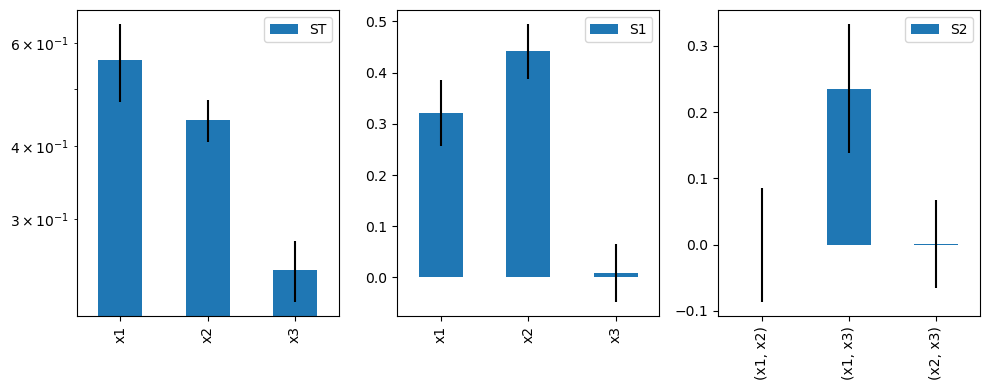
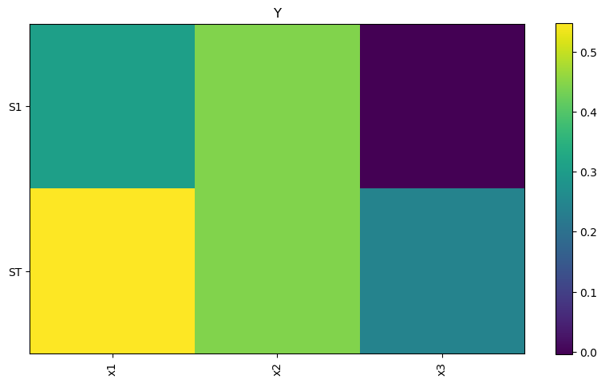
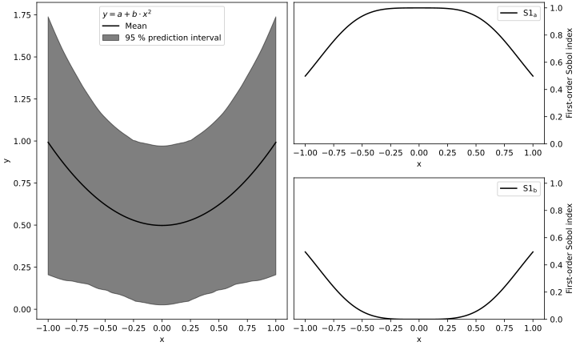

======
SALib Interface Basics
======

The earlier example is repeated on this page with the SALib `ProblemSpec` interface.
The interface provides an object-oriented approach to using SALib which some may
find easier to use. Note that the interface does add computational overhead
(thereby increasing runtimes) as it provides additional checks for users.

Developers who wish to integrate SALib into their own work may wish to use the
core API as detailed in the first example instead.

The Ishigami function
---------------------

As a reminder, we will perform a Sobol' sensitivity analysis of the Ishigami
function, shown below.

.. math::

    f(x) = sin(x_1) + a sin^2(x_2) + b x_3^4 sin(x_1)

The ProblemSpec Interface
~~~~~~~~~~~~~~~~~~~~~~~~~~~~~~~~~~~~~~~~~~~~~~

SALib provides a single interface from which all methods can be accessed.
The interface is called the :code:`ProblemSpec` (the Problem Specification).
One advantage to the interface is the method chaining approach which offers a
concise workflow. The sampling, evaluation and analysis trifecta can be run with:

.. code:: python

    import numpy as np

    from SALib.test_functions import Ishigami
    from SALib import ProblemSpec

    sp = ProblemSpec({
            "names": ["x1", "x2", "x3"],
            "groups": None,
            "bounds": [[-np.pi, np.pi]] * 3,
            "outputs": ["Y"],
        })

    (
        sp.sample_sobol(1024)
        .evaluate(Ishigami.evaluate)
        .analyze_sobol()
    )

    total_Si, first_Si, second_Si = sp.to_df()

    sp.plot()
    sp.heatmap()

Each step in the above is outlined in the sections below.

Importing SALib
~~~~~~~~~~~~~~~

First, the necessary packages are imported.

Here, we import numpy as well as the Ishigami test function (to use for this example)
and the :code:`ProblemSpec` interface.

.. code:: python

    import numpy as np

    from SALib.test_functions import Ishigami
    from SALib import ProblemSpec

Defining the Model Inputs
~~~~~~~~~~~~~~~~~~~~~~~~~

Next, we must define the model inputs.  The Ishigami function has three inputs,
:math:`x_1, x_2, x_3` where :math:`x_i \in [-\pi, \pi]`.  In SALib, we define
a :code:`dict` which holds the names of the inputs, and the bounds on each input.
Optionally, the expected output(s) can also be named.

.. code:: python

    sp = ProblemSpec({
        'names': ['x1', 'x2', 'x3'],
        'bounds': [
            [-np.pi, np.pi],  # bounds for x1
            [-np.pi, np.pi],  # ... x2
            [-np.pi, np.pi]   # ... x3
        ],
        'outputs': ['Y']
    })

As seen above, the :code:`ProblemSpec` simply wraps around a :code:`dict`.

Here, the default is to assume all inputs are uniformly distributed.

See :doc:`advanced` on how to provide further details, including alternate distributions.

.. note::

    If :code:`outputs` is not provided, then SALib will
    automatically create generic names.

    :code:`Y` for a single output
    :code:`Y1, Y2, ... Yn` for multiple outputs

Method Chaining
~~~~~~~~~~~~~~~

Since we are performing a Sobol' sensitivity analysis, we need to generate
samples using the Sobol' sampler, run the model, then analyze the outputs.

In the example above, all the steps are expressed as a `method chain <https://en.wikipedia.org/wiki/Method_chaining>`_

.. code:: python

    (
        sp.sample_sobol(1024)
        .evaluate(Ishigami.evaluate)
        .analyze_sobol()
    )

That said, each step can be run individually.
Note that the :code:`sample_` and :code:`analyze_` methods are shown with default arguments.

.. code:: python

    sp.sample_sobol(1024, calc_second_order=True)
    sp.evaluate(Ishigami.evaluate)
    sp.analyze_sobol(print_to_console=False, calc_second_order=True)

The :code:`samples`, :code:`results`, and results of :code:`analysis` are all held inside the :code:`sp` object.
If needed, these may be extracted via their respective attributes.

.. code:: python

    X = sp.samples
    y = sp.results
    S = sp.analysis

Internally, all data is handled as a numpy array/matrix.

.. tip::

    All sampling, evaluation and analysis methods may be accessed
    through the ProblemSpec interface and follow a standard pattern.

    - Sampling methods can be accessed with :code:`sp.sample_[name of method]`
    - Likewise, for analysis methods use :code:`sp.analyze_[name of method]`

    See the documentation of each method for further information.

Generating Samples
~~~~~~~~~~~~~~~~~~

In this example we are using the Sobol' sampling method (shown below with the default value for :code:`calc_second_order`).

.. code:: python

    sp.sample_sobol(1024, calc_second_order=True)

If we run :code:`sp.samples.shape`, we will see the matrix is 8192 by 3.
In other words, the Sobol' sampler generated :math:`N*(2D+2)` samples,
where in this example N is 1024 (the argument we supplied) and D is 3
(the number of model inputs).

The keyword argument :code:`calc_second_order=False` will exclude
second-order indices, resulting in a smaller sample matrix with
:math:`N*(D+2)` rows instead.

.. note::

    Specific sampling methods have their own requirements and behaviours.
    The documentation for each method lists a brief overview and includes
    references to provide further details.

A generic :code:`sp.sample` method is also available, allowing use of your own
sampling function.

.. code:: python

    sp.sample(my_sampler, *args, **kwargs)

The provided function must follow two requirements.

1. A :code:`ProblemSpec` must be accepted as its first argument.
   This can simply be defined as a dictionary following the same format as outlined above.
2. The function must return a numpy array.

If a sample has already been defined, this can be provided to the interface like so:

.. code:: python

    sp.set_samples(X)

where :code:`X` is a numpy array.

.. note::
    :code:`sp.set_results(Y)` can be used to set existing results.

.. warning::
    Care must be taken to avoid inappropriately mix-and-matching sampling and analysis methods.
    For example, Sobol' analysis must be conducted with a Sobol' sample.

Running a Model
~~~~~~~~~~~~~~~

If the model is written in Python, and is written such that it
can accept a numpy array as an input in its first position, then
it may be called directly with the interface.
Here, we use the Ishigami function as an example.

.. code:: python

    sp.evaluate(Ishigami.evaluate)

.. note::
    SALib also supports parallel model evaluation with
    `sp.evaluate_parallel()`. It is assumed that all results
    can be held in memory.

The Ishigami module provides an :code:`evaluate` function that
looks something like:

.. code:: python

    def evaluate(X: np.ndarray, A: float = 7.0, B: float = 0.1):

The actual implementation can be seen `here <https://github.com/SALib/SALib/blob/4a7c4b362df395cd62f8cc549030a2f6d03964c4/src/SALib/test_functions/Ishigami.py#L4>`_.

Note that the inputs (:code:`X`) is the first argument.

.. tip::
    For user-provided models, a wrapper can be written. A wrapper is
    a function that accepts parameters in the expected order, then
    runs the model itself.

    See also: :ref:`Another Example` , `functools.partial <https://docs.python.org/3/library/functools.html#functools.partial>`_

Note that SALib does not require direct interaction with the model.

If the model is written in Python, then it may be run manually without SALib.
Generally, you will loop over each sample input and evaluate the model:

.. code:: python

    Y = np.zeros([param_values.shape[0]])

    for i, X in enumerate(param_values):
        Y[i] = evaluate_model(X)

    # Provide the results to the interface
    sp.set_results(Y)

If the model is not written in Python, then the samples can be saved to a text file:

.. code:: python

    np.savetxt("param_values.txt", sp.samples)

Each line in :code:`param_values.txt` is one input to the model.  The output
from the model should be saved to another file with a similar format: one
output on each line.  The outputs can then be loaded with:

.. code:: python

    Y = np.loadtxt("outputs.txt", float)

    # Provide the results to the interface
    sp.set_results(Y)

Perform Analysis
~~~~~~~~~~~~~~~~

With the model outputs loaded, we can finally compute the sensitivity
indices.  In this example, we use Sobol' analysis, which will compute
first, second, and total-order indices.

.. code:: python

    sp.analyze_sobol()

We see an overview of the results once we print out the interface:

.. code:: python

    print(sp)

    Samples:
	3 parameters: ['x1', 'x2', 'x3']
	8192 evaluations

    Outputs:
        1 outputs: ['Y']
        8192 evaluations

    Analysis:
            ST   ST_conf
    x1  0.557271  0.078640
    x2  0.442311  0.040564
    x3  0.247103  0.025728

            S1   S1_conf
    x1  0.317728  0.060368
    x2  0.442253  0.056459
    x3  0.002556  0.054109

                    S2   S2_conf
    (x1, x2) -0.000604  0.071442
    (x1, x3)  0.247521  0.096797
    (x2, x3) -0.002954  0.072420

Here :code:`ST`, :code:`S1`, and :code:`S2` relate to the
total, first-order, and second-order sensitivity indices respectively.
Those ending with `_conf` indicate the corresponding confidence intervals,
typically with a confidence level of 95%.

We see that x1 and x2 exhibit first-order sensitivities but x3 appears to
have no first-order effects.

If the total-order indices are substantially larger than the first-order
indices, then there is likely higher-order interactions occurring.
We can look at the second-order indices to see these higher-order interactions:

.. code:: python

    y_S2 = sp.analysis['S2']
    print("x1-x2:", y_S2[0,1])
    print("x1-x3:", y_S2[0,2])
    print("x2-x3:", y_S2[1,2])

    x1-x2: 0.0092542
    x1-x3: 0.2381721
    x2-x3: -0.0048877

Results can also be extracted as Pandas DataFrames for further analysis.

.. code:: python

    total_Si, first_Si, second_Si = Si.to_df()

If the sample was created with :code:`calc_second_order=False`
then the second order sensitivities will not be returned

.. code:: python

    total_Si, first_Si = Si.to_df()

For multi-output models, sensitivity results for individual
outputs can be extracted:

.. code:: python

    sp.analysis['Y1']['S1']  # First order for Y1
    sp.analysis['Y2']['S2']  # Second order for Y2

Basic Plotting
~~~~~~~~~~~~~~~~

Basic plotting facilities are provided for convenience.

.. code:: python

    Si.plot()

All plotting methods will return matplotlib axes objects to allow later adjustment.

In the example below, the figure is created, the y-axis for the first subplot
is set to use log scale, and the figure size is adjusted with :code:`matplotlib`.

.. code:: python

    import matplotlib.pyplot as plt

    axes = sp.plot()
    axes[0].set_yscale('log')
    fig = plt.gcf()  # get current figure
    fig.set_size_inches(10, 4)
    plt.tight_layout()

In addition to the basic :code:`plot()` command, SALib can also produce a basic
heatmap.

.. code:: python

    sp.heatmap()

.. _Another example:

Another Example
---------------

When the model you want to analyse depends on parameters that are not part of
the sensitivity analysis, like position or time, the analysis can be performed
for each time/position "bin" separately. This can be useful for the purpose of
factor mapping, to identify where in parameter space the model is sensitive to.

Consider the example of a parabola:

.. math::

    f(x) = a + b x^2

The parameters :math:`a` and :math:`b` will be subject to the sensitivity analysis,
but :math:`x` will be not.

We start with a set of imports:

.. code:: python

    import numpy as np
    import matplotlib.pyplot as plt

    from SALib import ProblemSpec

and define the parabola:

.. code:: python

    def parabola(x, a, b):
        """Return y = a + b*x**2."""
        return a + b*x**2

The :code:`dict` describing the problem contains therefore only :math:`a` and :math:`b`:

.. code:: python

    sp = ProblemSpec({
        'names': ['a', 'b'],
        'bounds': [[0, 1]]*2,
    })

The triad of sampling, evaluating and analysing becomes:

.. code:: python

    # Create "bins" of x
    x = np.linspace(-1, 1, 100)

    # Create wrapper (runs each a, b combination separately)
    def wrapped_parabola(ab, x=x):
        y = np.zeros((ab.shape[0], x.shape[0]))
        for i, (a, b) in enumerate(ab):
            y[i,:] = parabola(x, a, b)

        return y

    (
        sp.sample_sobol(2**6)
        .evaluate(wrapped_parabola)
        .analyze_sobol()
    )

Note how we analyzed for each :math:`x` separately.

Now we can extract the first-order Sobol indices for each bin of :math:`x` and plot:

.. code:: python

    # Get first order sensitivities for all outputs
    S1s = np.array([sp.analysis[_y]['S1'] for _y in sp['outputs']])

    # Get model outputs
    y = sp.results

    # Set up figure
    fig = plt.figure(figsize=(10, 6), constrained_layout=True)
    gs = fig.add_gridspec(2, 2)

    ax0 = fig.add_subplot(gs[:, 0])
    ax1 = fig.add_subplot(gs[0, 1])
    ax2 = fig.add_subplot(gs[1, 1])

    # Populate figure subplots
    for i, ax in enumerate([ax1, ax2]):
        ax.plot(x, S1s[:, i],
                label=r'S1$_\mathregular{{{}}}$'.format(problem["names"][i]),
                color='black')
        ax.set_xlabel("x")
        ax.set_ylabel("First-order Sobol index")

        ax.set_ylim(0, 1.04)

        ax.yaxis.set_label_position("right")
        ax.yaxis.tick_right()

        ax.legend(loc='upper right')

    ax0.plot(x, np.mean(y, axis=0), label="Mean", color='black')

    # in percent
    prediction_interval = 95

    ax0.fill_between(x,
                     np.percentile(y, 50 - prediction_interval/2., axis=0),
                     np.percentile(y, 50 + prediction_interval/2., axis=0),
                     alpha=0.5, color='black',
                     label=f"{prediction_interval} % prediction interval")

    ax0.set_xlabel("x")
    ax0.set_ylabel("y")
    ax0.legend(title=r"$y=a+b\cdot x^2$",
               loc='upper center')._legend_box.align = "left"

    plt.show()

With the help of the plots, we interprete the Sobol indices. At
:math:`x=0`, the variation in :math:`y` can be explained to 100 % by
parameter :math:`a` as the contribution to :math:`y` from :math:`b
x^2` vanishes. With larger :math:`|x|`, the contribution to the
variation from parameter :math:`b` increases and the contribution from
parameter :math:`a` decreases.
